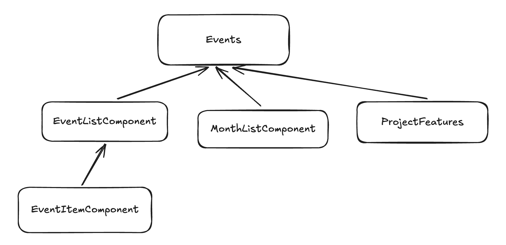
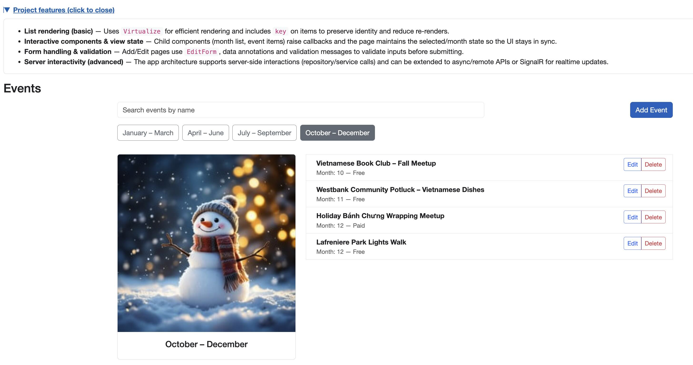

# Nn Blazor Project

A small learning Blazor project (for learning and experimentation).

This repository demonstrates a simple events application built with Blazor and .NET. It contains reusable components, form handling and validation, a tiny in-memory repository, and Bootstrap styling so you can focus on learning component design and data flow.

---

## Quick start

Prerequisites: .NET 7/8/9 SDK and a terminal or IDE (Rider, Visual Studio, VS Code).

From the project root run:

```bash
dotnet restore
dotnet build
dotnet run
```

Open the URL printed by `dotnet run` (usually `https://localhost:5001`). The `Events` page is the main learning surface.

---

## What you'll find here

- A simple Events page with search, month grouping, and a virtualized event list.
- Add / Edit pages using `EditForm` and data annotations for validation.
- Small, focused children components: `MonthListComponent`, `EventListComponent`, `EventItemComponent`.
- A tiny repository layer for demo data in `Repository/`.

---

## Features (ordered from basic → advanced)

1. List rendering (basic)
   - Uses Blazor's `Virtualize` and item `@key` to render lists efficiently and keep item identity.
2. Interactive components & view state
   - Page coordinates state (selected month, search text); child components raise events to update parent state.
3. Form handling & validation
   - Add/Edit use `EditForm`, `DataAnnotationsValidator` and `ValidationMessage` to validate user input.
4. Server interactivity (advanced)
   - The repository layer is synchronous now; easily replace it with `IEventService`/async APIs or SignalR for realtime updates.

---

## Project layout (important files)

- `Components/Pages/Events.razor` — main page that wires search, month selection, and the event list.
- `Components/Controls/MonthListComponent.razor` — month-group buttons and selection callback.
- `Components/Controls/EventListComponent.razor` — virtualized list container (owns filtering in current design).
- `Components/Controls/EventItemComponent.razor` — single event row with Edit/Delete actions.
- `Components/Pages/AddEvent.razor`, `EditEvent.razor` — forms for create/update.
- `Repository/` — in-memory repositories used for this demo.
- `wwwroot/images/` — place diagram and screenshots here.

### Design diagram



---

## Screenshot

Current UI (Events page):



- Search behavior: typing filters events by name; clearing the search restores the list for the selected month.
- Month selection: clicking a month clears the search and shows events for that month group.
- Delete flow: for simplicity the demo deletes from the repository and performs a reload; this can be changed to a parent-handled, in-memory update for a SPA experience.

---

## Future plans

- Move inline component styles into component-scoped `.razor.css` files (keeps Razor files tidy and removes analyzer warnings).
- Convert repository methods to async and update components to `async/await`.
- Replace the delete full-page reload with an EventCallback so the parent removes items without reloading.
- Add unit tests for repositories and a few component render tests (bUnit).
